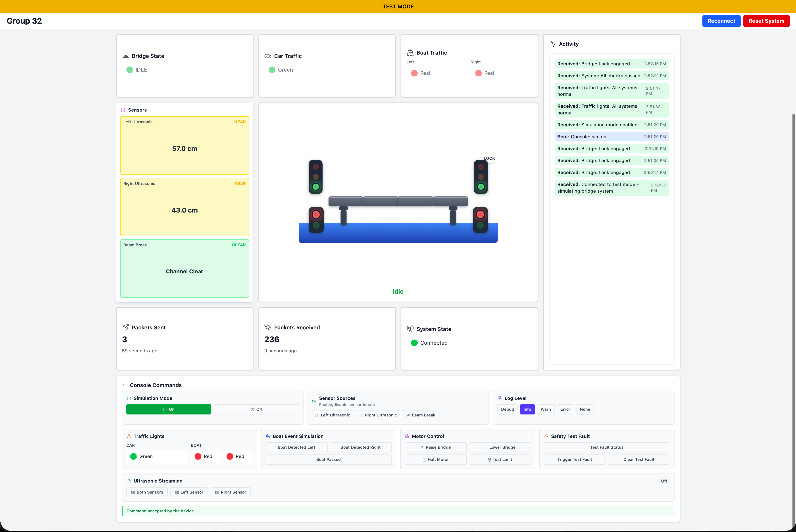

# ESP32 Bridge Control System



## Overview

An automated bridge control system built for ESP32 that manages bridge operations, traffic signals, and boat detection. The system features a real-time web dashboard for monitoring and manual control.

> **Project built during Semester 2 2025 for ENGG2000/3000.**

### Key Features

- **Automated Bridge Control**: State machine manages bridge opening/closing cycles
- **Traffic Management**: Coordinated traffic light control for vehicles and boats
- **Boat Detection**: Ultrasonic sensors and beam-break detection for boat passage
- **Safety Systems**: Fault detection, power recovery, and emergency protocols
- **Real Time Dashboard**: Web-based UI with live status updates via WebSocket
- **Manual Override**: Direct control of bridge and traffic signals when needed
- **Simulation Mode**: Gives the user the ability to test the system behaviour without relying on physical hardware

### System States

- **IDLE**: Normal operation, bridge closed, traffic is flowing
- **STOPPING_TRAFFIC**: Red lights activated, waiting for pedestrians to clear
- **OPENING/CLOSING**: Bridge in motion
- **OPEN**: Bridge raised, boats can pass
- **FAULT**: Safety system engaged
- **MANUAL_MODE**: Direct operator control, triggered by user commands, either through WebUI or Serial Monitor.

---

## Setup Instructions

### Prerequisites

- **Hardware**: ESP32 development board
- **Software**: 
  - [Git](https://git-scm.com/downloads)
  - [VSCode](https://code.visualstudio.com/download)
  - [Node.js](https://nodejs.org/) (v16 or higher)
- **Network**: 2.4GHz WiFi network

### 1. Initial Setup

```bash
# Clone the repository and open it in your IDE.
git clone <repository-url>
cd ENGG_TuePM
```

When prompted, install the recommended extensions (including PlatformIO).

### 2. Configure WiFi Credentials

Create a file `include/credentials.h`:

```cpp
#pragma once

#define WIFI_SSID "your_wifi_name"
#define WIFI_PASSWORD "your_wifi_password"
```

**Important**: Your WiFi must support 2.4GHz (ESP32 limitation).

### 3. Build and Upload to ESP32

1. Connect ESP32 to your computer via USB
2. In VSCode, click the PlatformIO icon (alien head) in the  sidebar
3. Under "Project Tasks", select:
   - **Build** (compiles the code)
   - **Upload** (flashes to ESP32)
   - **Monitor** (opens serial console)
   - *alternatively click* **Upload and Monitor**

4. Wait for the connection message:
   ```
   WiFi connected successfully!
   IP address: x.x.x.x
   ```

5. **Copy the IP address** - you'll need it for the frontend.

### 4. Configure Frontend

Navigate to `frontend/src/types/GenTypes.ts` and add your ESP32's IP:

```typescript
export enum IP {
  YOUR_ESP = "ws://192.168.x.x/ws",  // Replace with your IP
}
```

Then update `frontend/src/App.tsx` to use your IP alias:

```typescript
useEffect(() => {
  const client = getESPClient(IP.YOUR_ESP);  // Use your alias here
  client.onStatus(setWsStatus);
  // ...
```

### 5. Run the Frontend

```bash
cd frontend

# Install dependencies (first time only)
npm install

# Start development server
npm run dev
```

Open the displayed URL (e.g., `http://localhost:5173`) in your browser.

### 6. Test Mode (Frontend Only)

The frontend includes a **test/dummy mode** that allows you to test the UI without connecting to any backend systems. This is useful for:
- Testing UI changes without hardware
- Demonstrating the interface
- Development when the ESP32 is unavailable

**To enable test mode:**

Add `?test=true` to the URL:
```
http://localhost:5173?test=true
```

When test mode is active:
- A yellow banner appears at the top indicating test mode
- All data is simulated (bridge states, sensors, traffic lights)
- Console commands are mocked (some commands like "help", "status", "reset" are recognised)
- No actual WebSocket connections are made
- The UI updates with dummy data that changes over time

### 7. Verify Connection

When the frontend connects successfully:
- Browser shows "Connected" status
- ESP32 serial monitor displays: `Client # connected`
- Dashboard displays real-time bridge status
- You can manually trigger a reconnect by clicking the button at the top of the UI.

---

## Development Workflow

### Making ESP32 Changes

1. Edit code in `src/` or `include/`
2. Build and upload via PlatformIO
3. Monitor serial output for debugging

### Making Frontend Changes

- Changes auto-reload in the browser (no restart needed)
- Check browser console for errors

### Testing Commands

Use the Console panel in the web UI to send commands.

---

## Project Structure

```
├── src/                 # ESP32 C++ source files
├── include/             # Header files
├── frontend/            # React/TypeScript web dashboard
│   ├── src/
│   │   ├── components/  # UI components
│   │   ├── hooks/       # WebSocket and state management
│   │   └── lib/         # API and WebSocket clients
├── platformio.ini       # ESP32 build configuration
└── credentials.h        # WiFi credentials (create this!)
```
---

## Troubleshooting

**ESP32 won't connect to WiFi**
- Verify 2.4GHz network
- Check credentials.h formatting
- Ensure network is not hidden

**Frontend can't connect**
- Verify IP address in GenTypes.ts matches serial output
- Check if ESP32 is on same network
- Ensure `ws://` prefix is included

**Upload fails**
- Check USB cable connection
- Close serial monitor before uploading
- Try a different USB port
